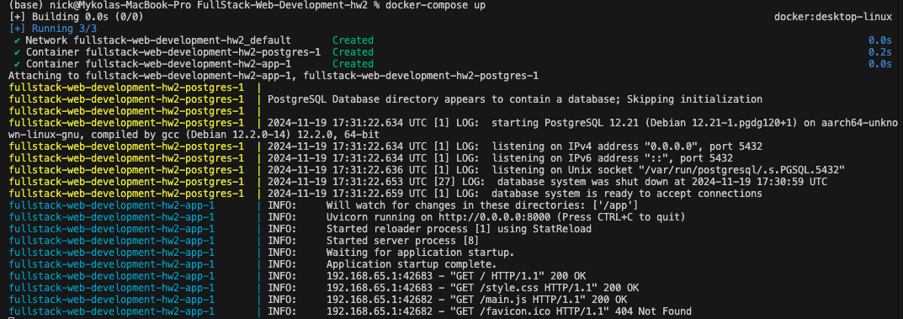
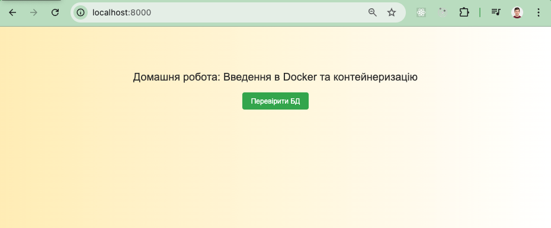
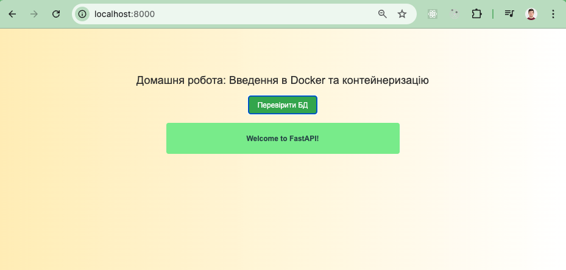

# goit-pythonweb-hw-02

1. Склонуйте репозиторій

2. Створіть Dockerfile із вказівками для створення образу Docker застосунку.

3. Напишіть docker-compose.yaml з конфігурацією для застосунку та PostgreSQL.

4. Використайте Docker Compose для побудови середовища, команду docker-compose
   up для запуску середовища.

   

5. Перевірте функціональність застосунку та доступність бази даних.

   

   
